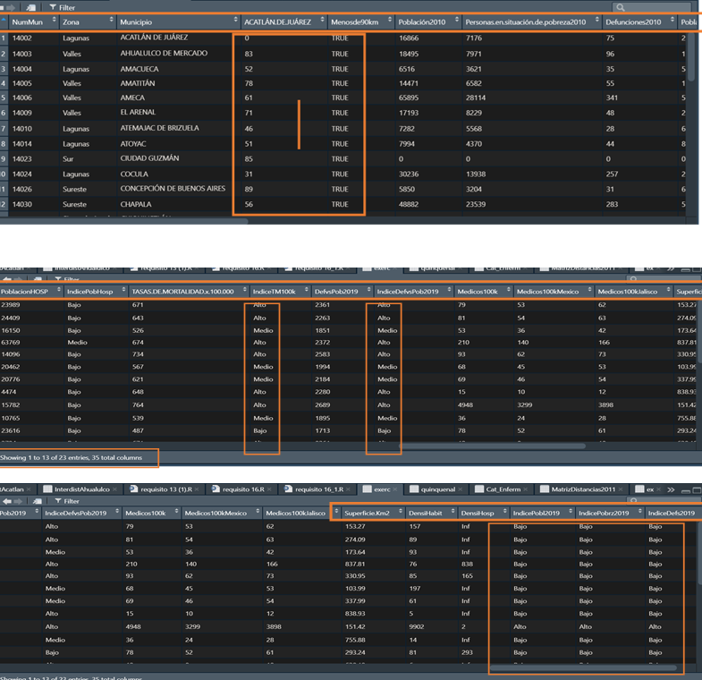
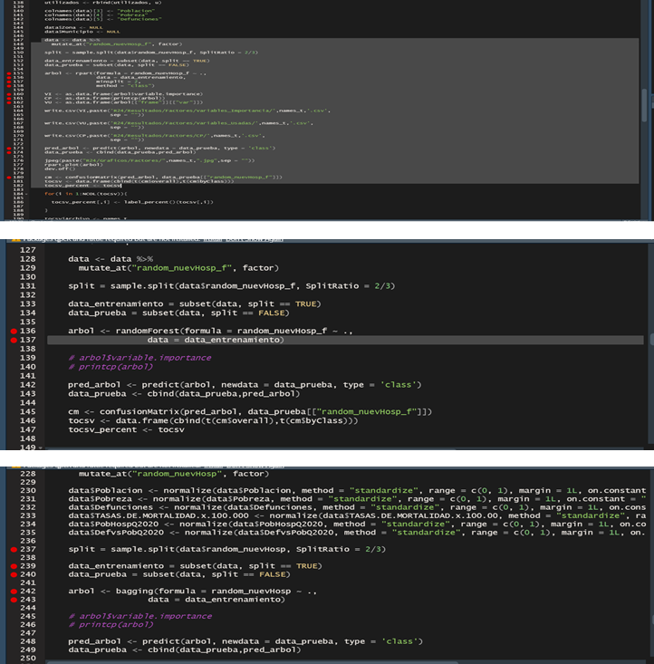
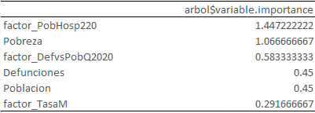
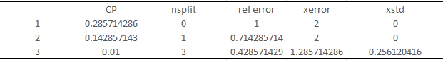
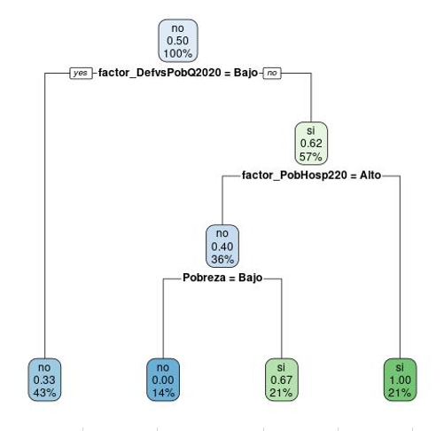
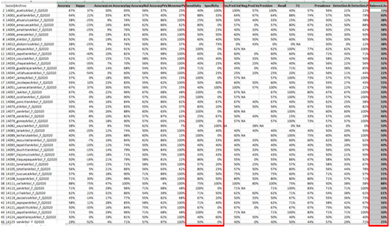

# Anexo 1

Agrupamiento de municipios y categorización de variables.

{width=50%}

# Anexo 2

Código fuente para árboles de decisión, random forest y baggin

{width=50%}

# Anexo 3

Ejemplo de árbol de decisión, variables de importancia y estadístico de resultados

{width=50%}
{width=50%}
{width=50%}
{width=50%}