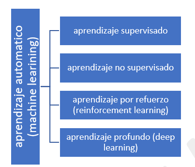

# Inteligencia Artificial

La brecha digital mundial y nacional ha alcanzado todas las ciencias; las ciencias médicas particularmente han llegado a ser una simbiosis productiva con la tecnología. Desde la ortopedia con el uso de prótesis de materiales más resistentes, hasta el uso de dispositivos y aplicaciones para el seguimiento y autocontrol en diferentes padecimientos. Además, en los últimos años, la mejora en el análisis de datos médicos para la interpretación de diagnósticos más efectivos y eficientes, así como de los generados en los hospitales. Este análisis de grandes datos (*big data*, por sus siglas en inglés), sólo es posible con el uso de la Inteligencia Artificial (AI, *Artificial Intelligence*, por sus siglas en inglés). Los datos masivos también incluyen conjuntos de datos específicos con tamaños y complejidades elevados que requieren técnicas algorítmicas nuevas para extraer de ellos información útil. Los datos en todas sus formas, poseen el potencial de proporcionar un caudal de información útil siempre que se logre desarrollar el modo de extraerla (Alsina, 2017). Las técnicas nuevas combinan la estadística tradicional con la informática y hacen cada vez más viable el análisis de grandes volúmenes de datos. Estas técnicas y algoritmos desarrollados por especialistas en estadística e informática, buscan patrones en los datos. La clave del éxito en análisis de datos masivos radica en determinar qué patrones son los relevantes (Nin Guerrero, 2019). El advenimiento de la era digital conlleva cambios que alteran de un modo sustancial la manera de recopilar los datos, almacenarlos y analizarlos.

La IA utiliza diferentes métodos de aprendizaje automático (*machine learning*, por sus siglas en inglés); tipos de algoritmos y sus características básicas que pueden clasificarse de la siguiente manera:

# Métodos de Inteligencia Artificial.

{width=50%}

***Fuente:*** *Elaboración propia.*

- ***Aprendizaje automático (ML).*** Utiliza algoritmos para detectar patrones y predicciones en los datos. 
Machine learning es una forma de la IA que permite a un sistema aprender de los datos en lugar de aprender mediante la programación explícita. Sin embargo, machine learning no es un proceso sencillo. Conforme el algoritmo ingiere datos de entrenamiento, es posible producir modelos más precisos basados en datos. Un modelo de machine learning es la salida de información que se genera cuando entrena su algoritmo de machine learning con datos. Después del entrenamiento, al proporcionar un modelo con una entrada, se le dará una salida. Por ejemplo, un algoritmo predictivo creará un modelo predictivo. A continuación, cuando proporcione el modelo predictivo con datos, recibirá un pronóstico basado en los datos que entrenaron al modelo. Después de que un modelo ha sido entrenado, se puede utilizar en tiempo real para aprender de los datos. Las mejoras en la precisión son el resultado del proceso de entrenamiento y la automatización que forman parte del machine learning.

- ***Aprendizaje supervisado.*** Se etiquetan los datos para pronosticar la salida.
El aprendizaje supervisado comienza típicamente con un conjunto establecido de datos y una cierta comprensión de cómo se clasifican estos datos. El aprendizaje supervisado tiene la intención de encontrar patrones en datos que se pueden aplicar a un proceso de analítica. Estos datos tienen características etiquetadas que definen el significado de los datos. Por ejemplo, se puede crear una aplicación de machine learning con base en imágenes y descripciones escritas que distinga entre millones de animales.

- ***Aprendizaje no supervisado.*** No se etiquetan los datos, se buscan similitudes.
El aprendizaje no supervisado se utiliza cuando el problema requiere una cantidad masiva de datos sin etiquetar. Por ejemplo, las aplicaciones de redes sociales, tales como Twitter, Instagram y Snapchat, tienen grandes cantidades de datos sin etiquetar. La comprensión del significado detrás de estos datos requiere algoritmos que clasifican los datos con base en los patrones o clústeres que encuentra. El aprendizaje no supervisado lleva a cabo un proceso iterativo, analizando los datos sin intervención humana. Un ejemplo clásico se utiliza con la tecnología de detección de spam en e-mails. Existen demasiadas variables en los e-mails legítimos y de spam para que un analista etiquete una cantidad masiva de e-mail no solicitado. En su lugar, los clasificadores de machine learning, basados en clustering y asociación, se aplican para identificar e-mail malicioso.

- ***Aprendizaje por refuerzo.*** Este tipo de algoritmos son una mezcla de los dos anteriores.

- ***Deep learning (DL).*** Basado en funcionamiento de redes neuronales humanas.
El deep learning es un método específico de machine learning que incorpora las redes neuronales en capas sucesivas para aprender de los datos de manera iterativa. El deep learning es especialmente útil cuando se trata de aprender patrones de datos no estructurados. Las redes neuronales complejas de deep learning están diseñadas para emular cómo funciona el cerebro humano, así que las computadoras pueden ser entrenadas para lidiar con abstracciones y problemas mal definidos. Las redes neuronales y el deep learning se utilizan a menudo en el reconocimiento de imágenes, voz y aplicaciones de visión de computadora.

**Estadística.**

La estadística es una disciplina científica que se ocupa de la obtención, orden y análisis de un conjunto de datos con el fin de obtener explicaciones y predicciones sobre fenómenos observados. Se puede subdividir en dos grandes ramas: descriptiva e inferencial. https://economipedia.com/definiciones/estadistica.html

**Estadística descriptiva.**

Se refiere a los métodos de recolección, organización, resumen y presentación de un conjunto de datos. Se trata principalmente de describir las características fundamentales de los datos y para ellos se suelen utilizar indicadores, gráficos y tablas. https://economipedia.com/definiciones/estadistica.html

**Estadística inferencial.**

Se refiere a los métodos utilizados para poder hacer predicciones, generalizaciones y obtener conclusiones a partir de los datos analizados teniendo en cuenta el grado de incertidumbre existente. https://economipedia.com/definiciones/estadistica.html

# Inteligencia Artificial y Salud

En el campo específico del Análisis de Datos, la IA constituye una de las líneas de actuación de futuro más prometedoras, con posibilidades de aplicación tanto en el campo de la investigación como en el diseño de sistemas de información inteligentes, que no sólo proporcionar datos al tomador de decisiones, pero también recomendar el mejor curso de acción a seguir. Durante la última década, el aumento en el poder de cómputo y los avances en la tecnología para grandes conjuntos de datos han brindado nuevas perspectivas en tales disciplinas y en otras relacionadas, como el aprendizaje automático (ML), que ha llevado a una completamente nueva perspectiva llamada *análitica*, que ha demostrado ser drásticamente invaluable para ayudar a los tomadores de decisiones en negocios y salud.

El uso de la inteligencia artificial, permitió el uso de grandes cantidades de datos en todos los sectores. En medicina, marca el inicio de un fuerte impacto en tres aspectos:

1. en clínica, la interpretación rápida de imágenes con altos grados de precisión;

2. en los sistemas de salud, mejorando el flujo de trabajo y el potencial para reducir significativamente los errores médicos (humanos); y

3. en los pacientes, para habilitarlos en el proceso de autocontrol para la promoción de la salud.

Las crecientes aplicaciones de *ML* en productos farmacéuticos y medicina son un vistazo de un futuro potencial donde la sincronización de datos, análisis e innovación es una realidad cotidiana.

Desarrollos potenciales de *ML* en áreas clínicas:

- Identificación/diagnóstico de enfermedades
- Trato personalizado / modificación de conducta
- Descubrimiento y fabricación de fármacos.
- Investigación de ensayos clínicos
- Radiología y radioterapia
- Registros Electrónicos Inteligentes de Salud (EHR)
- Predicción de brotes
- Ciencias genómicas
- Y con potencial para predecir infraestructuras sanitarias

"El mundo de la atención médica está cambiando significativamente gracias al análisis de *big data*" (Holmes, 2018).